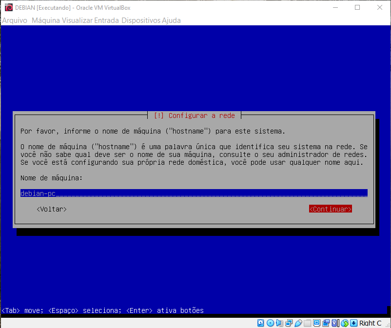
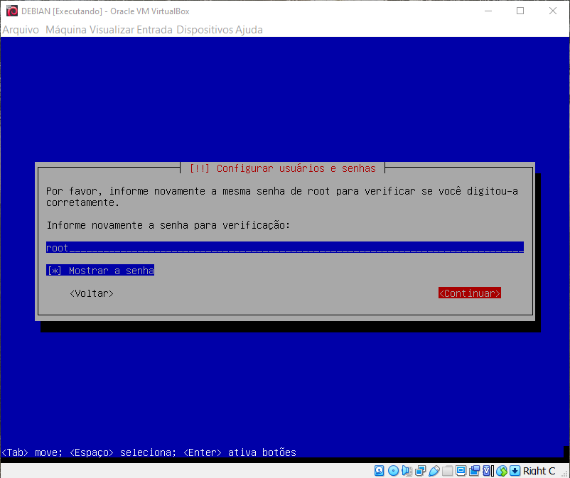
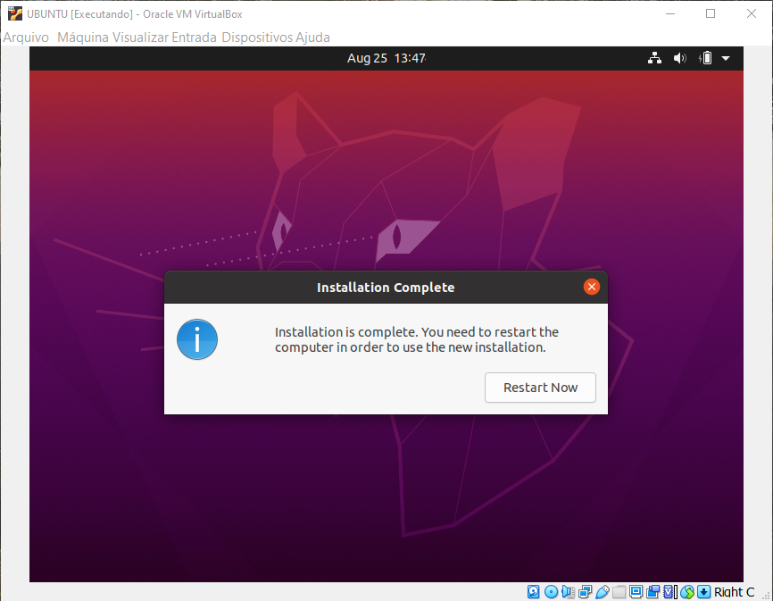

# INSTALANDO O LINUX

## SUMÁRIO
* Criando uma máquina virtual
* Instalando o Debian 11 (sem interface gráfica)
* Instalando o Ubuntu 20.04 (com interface gráfica)

## CRIANDO UMA MÁQUINA VIRTUAL
* Baixe e instale um software de virtualização, observando o sistema operacional da sua máquina e a arquitetura do processador:
    * [Oracle VirtualBox](https://www.virtualbox.org/wiki/Downloads); ou,
    * [VmWare Workstation Player](https://www.vmware.com/products/workstation-player.html)

1. Execute o programa de instalação VIRTUALBOX e clique em “NOVO” na tela principal, e a seguir, na janela "criar máquina virtual", escolha o nome, o tipo e a versão do sistema operacional que será instalado. No caso, foi dado o nome "Ubuntu" para máquina, tipo "Linux" e versão "Ubuntu 64-bit). Clique em próximo.

    

    

1. Selecione a quantidade de memória RAM da máquina. Clique em próximo. A seguir, selecione "criar um novo disco rígido virtual agora". Clique em criar. 
    * Observe os requisitos recomendados para instalação do sistema pelos desenvolvedores da distribuição que deseja instalar. Para o [Ubuntu 20.04](https://ubuntu.com/download/desktop), o site da distribuição recomenda 4GB de memória para o sistema e 25GB de espaço de disco, já para o [Debian 11](https://www.debian.org/download), recomenda-se 2GB de memória e 10GB de espaço livre em disco.

    

    

1. Na janela "criar disco rígido virtual", selecione "VDI (virtualbox disk image)" para o tipo de arquivo de disco rígido. Clique em próximo. A seguir escolha a opção "dinamicamente alocado" para o armazenamento em disco rígido físico. Por fim, selecione o tamanho do disco a ser criado e clique em "criar".

    

    

    

1. Na janela inicial, clique em "[disco óptico]Vazio" e selecione a imagem da distribuição linux baixada previamente. Caso o não seja mostrada no menu de seleção, clique em "escolher uma imagem de disco" e selecione o local em que o arquivo de imagem foi salvo em seu computador. Por fim, clique em "INICIAR" para ligar a máquina virtual e começar a instalação do Linux.

    

    

## INSTALANDO O DEBIAN 11

1. Clique em "iniciar" em sua maquina virtual criada anteriormente e aguarde. Na tela inicial, selecione "INSTALL".

    

    * Na instalação sem interface gráfica, a navegação é feita a partir das setas direcionais do teclado, alternando-se entre os campos com a tecla "TAB", e fazendo a seleção com a tecla "ENTER" ou marcações (em caixas de seleção), com a tecla "ESPAÇO".

1. Selecione o idioma padrão para o sistema "Portuguese (Brazil)".

    

1. Selecione a localidade para "Brasil".

    

1. Configure o layout de teclado para "Português Brasileiro".

    

1. Preencha o nome do computador (host). Tecle "TAB" para alternar entre os campos até "continuar". Na tela seguinte, deixe o nome de domínio em branco.

    

    

1. Crie uma senha para o usuário ROOT (lembre desta senha!) e na tela seguinte, confirme a senha criada. Para alternar entre os campos utilize a tecla "TAB". Caso queira visualizar a senha criada, aperte "espaço" quando estiver no campo "mostrar senha".

    

    

1. Preencha o nome completo do primeiro usuário a ser criado. Nas telas seguintes, crie o nome de usuário para login, crie uma senha para o usuário e confirme a senha criada.

    

    

    

    

1. Aguarde o carregamento das configurações iniciais do sistema para data e hora do sistema. Na tela "configurar relógio", selecione sua região (Paraíba).

    

    

1. Na tela "PARTICIONAR DISCOS", selecione a opção "MANUAL". A seguir, Selecione o disco que será particionado. E confirme a criação da tabela de partiçoes vazia no dispositivo. 

    

    

    

1. Selecione a partição com espaço livre inicial. Escolha "criar uma nova partição" na tela seguinte. Peencha o campo de tamanho da partição com 2 GB. Escolha o tipo de partiçõ "PRIMÁRIA" e localização "INÍCIO". Selecione o campo "usar como" e altere para "área de troca - swap". Por fim, selecione "finalizar a configuração da partição" para criar a primeira partição do disco, que corresponderá a área de troca.

    

    

    

    

    

    

    

    

1. Repita o mesmo procedimento para criar uma partição para o sistema ("/"raiz) e arquivos de usuários (/home), sempre selecionando o tipo de partição "PRIMÁRIA" e localização "INÍCIO". A partição para raiz (/) deve ter 10 GB, usar como "sistema de arquivos com "journaling" ext4 e ponto de montagem: "/". Já a partição para arquivos de usuários, deve ter o corresponte ao restante do espaço livre, usar como "sistema de arquivos com "journaling" ext4 e ponto de montagem: "/home". Finalize o particionamente e escreva as mudanças no disco.

    

    

    

    

    

    
    
    

## INSTALANDO O UBUNTU 20.04

1. Clique em "iniciar" em sua maquina virtual criada anteriormente e aguarde. Na tela de "boas vindas", selecione o idioma de instalação e clique em "instalar Ubuntu".

    

1. A seguir, selecione o layout do teclado de acordo com seu padrão do seu sistema

    

1. Nas opções de atualização e softwares, selecione a instalação normal, download de atualizações (caso a internet esteja disponível) e opcionalmente, a instalação de softwares de terceiros. Clique em "continuar".

    

1. No tipo de instalação, selecione "apagar disco e instalar Ubuntu" e clique em "instalar agora". Caso deseje configurar as partições, selecione "something else".

    

1. Escolha a região para definições de hora e data selecionando sua região no mapa exibido. Clique em "continuar".

    

1. Preencha seu nome completo, nome do computador, nome de usuário e senha de acesso. Clique em "continuar".

    

1. Aguarde o assistente de instalação terminar. O processo pode demorar alguns minutos. Ao final da instalação, clique em "reiniciar agora". Caso receba uma mensagem para retirar o disco de instalação, clique em "máquina" > "configurações" e certifique-se que o disco óptico esteja vazio. Clique em "OK" e aguarde a reinicialização da máquina. Caso a máquina virtual não reinicie sozinha, reabra o virtualbox, assegurando-se que o disco óptico esteja vazio, e inicie a máquina.

    

    

    

    

    
